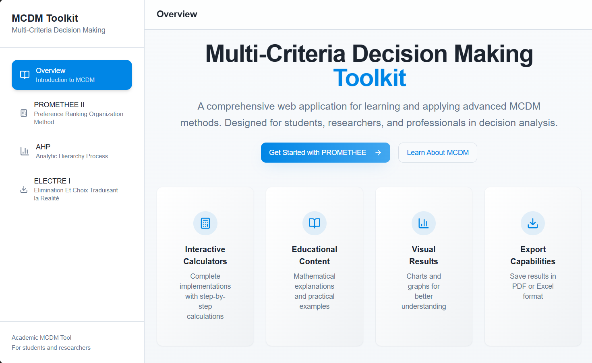

# Multi-Criteria Decision Making (MCDM) Toolkit

A comprehensive web application for learning and applying advanced multi-criteria decision-making methods. Designed for students, researchers, and professionals in decision analysis.

## Tech Stack

- Vite
- TypeScript
- React
- shadcn-ui
- Tailwind CSS
- Framer Motion
  
##  Screenshots

   
